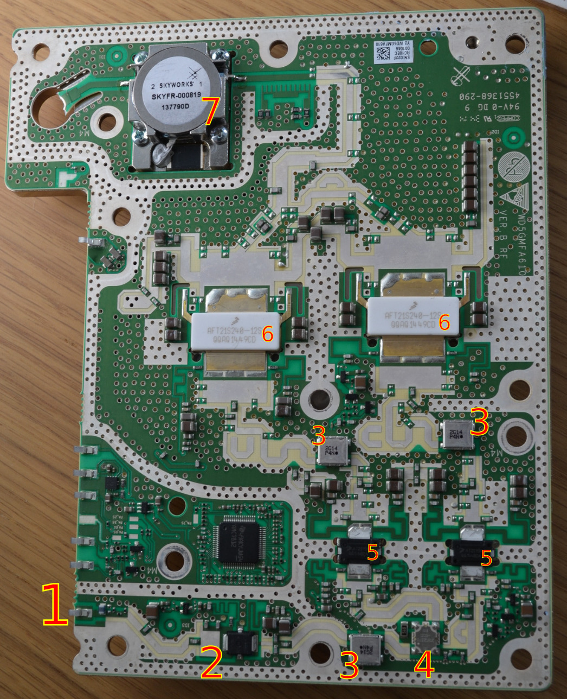

# UMTS PA from Fojutowo Microwave Meetup

The amplifier board comes from a commercial 2100-band cell amplifier. I'm planning to retune it to 2400 MHz for QO-100 DATV operation.

## Board layout

1. Signal input
2. [MW6S004NT1](https://www.nxp.com/docs/en/data-sheet/MW6S004N.pdf)
* RF N-MOSFET
* wideband matching (datasheet says "up to 2000 MHz" - lol)
* 18 dB gain, P1dB >+37dBm (nice), 28V
3. "2G14 P4N"
* 2.14G filter?
* bandwidth - unknown (to be measured)
* unable to find datasheet - custom production run?
4. [X3C21P1-05S](https://www.richardsonrfpd.com/docs/rfpd/X3C21P1-05S_Data_Sheet_revA.pdf)
* 5dB splitter for 2000-2300 MHz
* maybe wideband just enough - DS ends on 2300 MHz
* ideal replacement: X3C25P1-05S (2300-2700 MHz) - [4€ @ Mouser](https://eu.mouser.com/ProductDetail/Anaren/X3C25P1-05S)
* why 5 dB? need to figure out the layout (Doherty amplifier..?)
5. [AT2S15N / AFT20S015N](https://www.nxp.com/docs/en/data-sheet/AFT20S015N.pdf)
* 1800-2700 MHz, N-MOSFET
* ~17 dB gain @ 2100 MHz, P1dB 16W, 28V
6. [AFT21S240-12S](https://www.nxp.com/docs/en/data-sheet/AFT21S240-12S.pdf)
* N-LDMOS
* internal matching 2110-2170 MHz
* ~20dB gain, P1dB 230W, 28V
* datasheet page 7, 2400 MHz: >20dB gain, -10dB IRL
7. [SKYFR-000819]
* 0.5 kW 2110-2170 MHz isolator
* to be replaced with a piece of semirigid coax?

## Steps
* remove one of the small silver filters and measure its frequency response
* supply bias voltage to the respective stages, possibly by reusing the AMC7812 chip instead of homebrewing own bias solution
* read AMC7812 datasheet, check if it has some kind of internal memory
* identify left-hand-side connectors (where's the main VCC? top left?)
